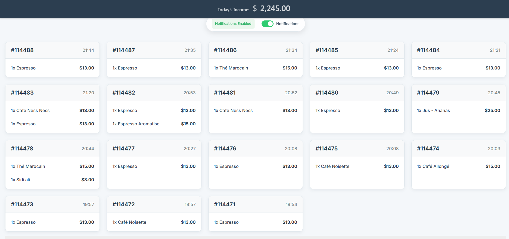
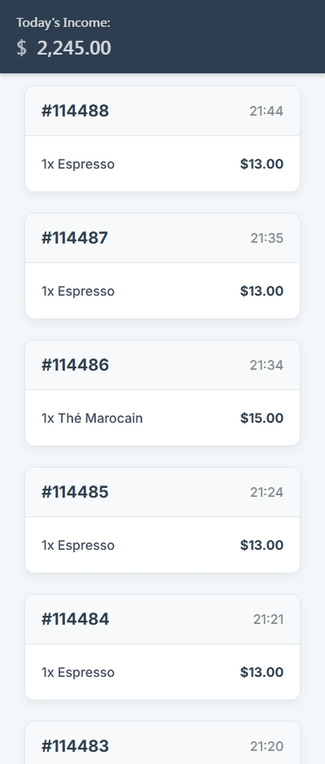

# WooCommerce Live Order Feed

I got tired of constantly refreshing my WooCommerce orders page to see if new orders came in, so I built this. Now orders show up automatically and I get notifications even when I'm not looking at the screen.

## Before You Start

**Important:** You need to configure a few things before using this plugin:

1. **VAPID Keys for Push Notifications**
   - Open `woocommerce-live-order-feed.php`
   - Replace `YOUR_PUBLIC_KEY_HERE` and `YOUR_PRIVATE_KEY_HERE` with your own keys
   - Generate free keys at: https://vapidkeys.com/

2. **Plugin Header Info** 
   - Update "Your Name Here" in the plugin file header
   - Change GitHub URL to your actual repository

3. **Page Slug**
   - The plugin looks for a page with slug `feed-2` by default
   - Either create a page with that slug, or modify the code to match your page

## What it does

- Orders appear on your screen as soon as they come in (no more F5 spam)
- Push notifications work even when you close the browser tab
- Works offline if your internet cuts out temporarily  
- Can install it on your phone like a regular app
- Optional "ding" sound when new orders arrive (toggle it off if it gets annoying)
- Doesn't slow down your browser - runs everything in the background

## Screenshots

### Live Order Feed in Action

*Real-time order updates without page refresh*

### Push Notifications

*Get notified even when browser is closed*

### Mobile PWA

*Install on phone like a native app*

### Setup Screen

*Simple one-click notification setup*

## Why I built this

Running a WooCommerce store means being glued to your orders page. I was refreshing it every few minutes like a maniac. This plugin lets me actually get work done while still knowing instantly when orders come through.

## Requirements

You'll need:
- WordPress (pretty much any recent version)
- WooCommerce plugin active
- PHP 7.4+ (most hosts have this now)
- HTTPS/SSL for push notifications to work properly

## Setup

**Before installing, make sure you've configured the placeholders mentioned above!**

*Note: Screenshots show example setup - your interface may look slightly different depending on your WordPress theme.*

Basic install:
1. Download and extract to `/wp-content/plugins/`
2. **Configure VAPID keys** (see "Before You Start" section)
3. Activate it in WordPress admin
4. Create a page with slug `feed-2`, add `[live_order_feed]` shortcode
5. Done

## Using it

Just visit your page with the shortcode. If you're logged in, you'll see your orders and get a button to enable notifications. 

The notification permission popup can be annoying - browsers require user interaction before allowing notifications, so you have to click "Enable" first.

On mobile, you might get an "Add to Home Screen" prompt. Do it - makes it feel like a native app.

## Customization

It works out of the box, but if you want to tinker:

### VAPID Keys (Required)
You MUST replace the placeholder keys in `woocommerce-live-order-feed.php`:
```php
// Replace these with your own keys from https://vapidkeys.com/
private const VAPID_PUBLIC_KEY = 'YOUR_PUBLIC_KEY_HERE';
private const VAPID_PRIVATE_KEY = 'YOUR_PRIVATE_KEY_HERE';
```

### Your own icons/sounds
Drop files in the assets folders:
- `assets/icons/` - notification and app icons  
- `assets/sounds/` - change that notification sound
- `assets/css/` - make it look however you want

## Technical stuff

Uses service workers for notifications and caching, web workers for background processing, polls for new orders every 7 seconds. Pretty standard modern web stuff.

Browser support is good - works in Chrome, Firefox, Edge. Safari is... Safari (limited push support).

## If something breaks

**Orders not showing up?**
- Is WooCommerce actually running?
- Are you logged in?
- Check browser console for errors

**No notifications?**
- You need HTTPS (browsers won't do notifications on HTTP)
- Check if you accidentally blocked notifications
- Make sure you clicked "Enable" first
- **Most common issue:** You forgot to replace the placeholder VAPID keys!

**Can't install as app?**
- Service worker might not be working
- Check if icons are the right size (192px, 512px)

I test this on my own store, so it should work. If it doesn't, open an issue and I'll take a look.

## Contributing

Found a bug? Want to add something? Cool. Fork it, fix it, send a pull request. Try to test your changes first though.

## License

GPL v2 - standard WordPress plugin license.

---

*Note: Needs WooCommerce to be useful. Works best with HTTPS.*
